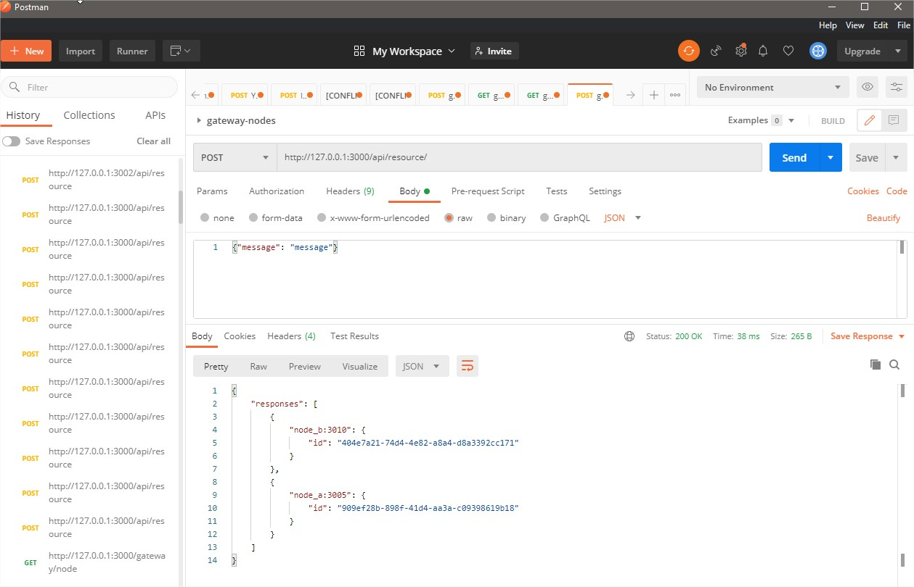
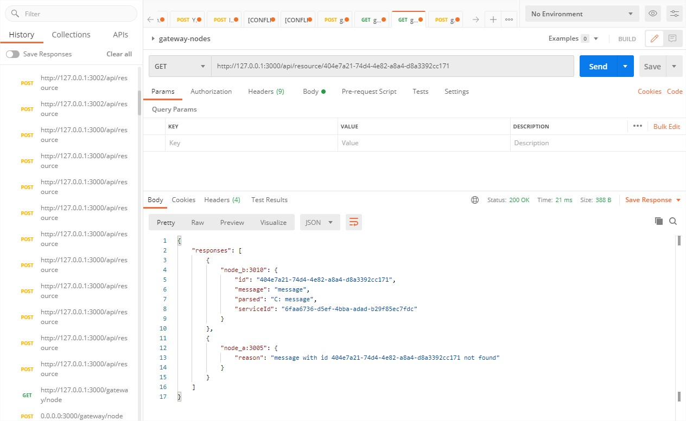
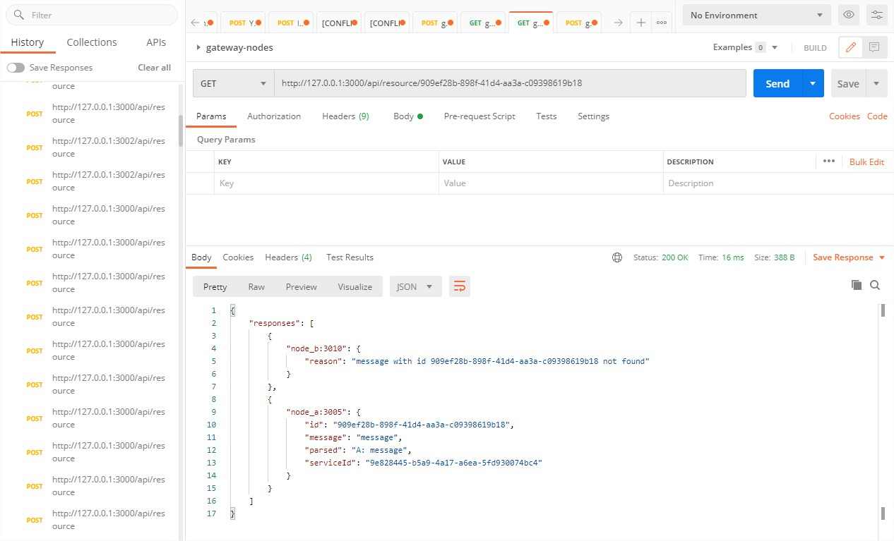

# dors-fastapi-gateway-nodes-arch

Implementation of a Gateway architecture using FastAPI async servers. 

#### Gateway server

FastAPI async server, responsible to deliver incoming messages to all of the registered nodes.

#### Node server

FastAPI async server, responsible to parse incoming messages from the gateway.
On startup, Every Node registers himself in the Gateway's local state, using the  (POST)`/gateway/node` endpoint.


## Installation

Use the package manager [pip](https://pip.pypa.io/en/stable/) to install.

```bash
pip install -r requirements.txt
```


## Usage

To run with docker-compose:
```bash
(venv) D:\PycharmProjects\dors-fastapi-gateway-nodes-arch>docker-compose up
```
> Currently, there are 2 node servers.
>
> You can add more by adding another services in the docker-compose.yaml file.


## Demo

#### Posting new message



#### Getting resource by first id (unique to every node)



#### Getting resource by second id (unique to every node)




## License

[MIT](https://choosealicense.com/licenses/mit/)
